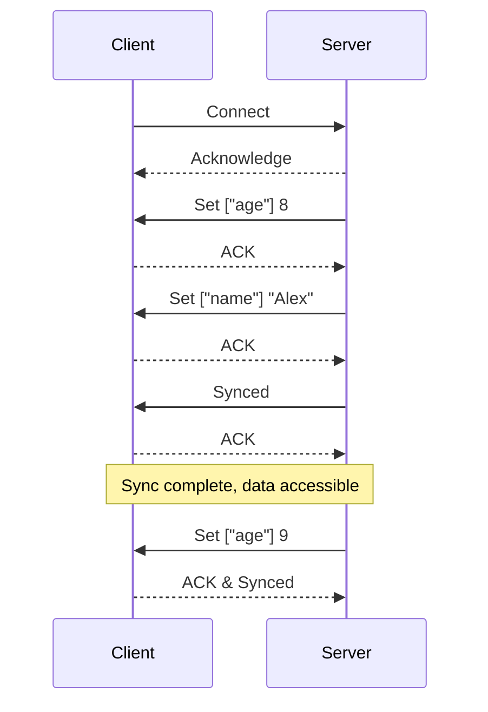

# JSRF Protocol

## Introduction

The JSRF Protocol (JSON Synchronization and Remote Function Protocol) is designed for synchronizing JSON objects and invoking remote functions between servers and clients.
It is particularly useful in scenarios requiring continuous object state tracking, frequent remote function calls, and bidirectional function invocation or object editing.
For web applications, it is recommended to implement this protocol over WebSocket, though TCP can also be used if supported by both parties.

## Implementation Guidelines

To AI or human engineers:

1. Implement this protocol using `ws` for WebSocket with browser-native WebSocket for clients and `ws` module for servers, paired with `cbor` for payload encoding.
2. Write code in TypeScript using ES modules (ESM).
3. Use English for code comments.
4. Avoid custom mock objects in testing; use established modules to simulate real-world scenarios for better reliability.
5. Note that the server provided by this module is a handler function designed to work with a WebSocket object. The initialization and setup of the WebSocket server are not handled by this module and must be planned and implemented by the user according to their specific requirements.

## Overview

The JSRF Protocol enables bidirectional synchronization of JSON objects and remote function calls, supporting dynamic interactions between client and server.
Implementations must be adaptable; for instance, objects might originate from a database, requiring CRUD operations to be bound to database actions.
All remote functions must be asynchronous to handle such dependencies effectively.

## Packet Structure

Packets consist of headers (7–11 bytes) and a payload (variable length).

- A connection can subscribe to up to 65536 channels, each corresponding to a service, with a server-side Map linking service IDs to channel IDs.
- Channels are queried on first use, and results are cached for future interactions.
- Sequence numbers (seq) increment with each packet sent and must not overflow.
- Acknowledgments (ACK) are sent in response to received messages, with a 10-second timeout triggering disconnection if no ACK is received.
- Payloads can be encoded using JSON, `cbor`, `@msgpack/msgpack`, or `@cch137/shuttle` in array format, with `cbor` recommended for its balance of size, speed, and extensibility.

### Headers Structure

| Name    | Length (bytes) | Description                                   |
| ------- | -------------- | --------------------------------------------- |
| has-ack | 1/8            | ENUM: 0 = false, 1 = true                     |
| opcode  | 7/8            | Range: [0, 127]                               |
| channel | 2              | Range: [0, 65535]                             |
| seq     | 4              | Range: [0, 2^24-1]                            |
| ack     | 4 (optional)   | Present if has-ack is true; otherwise absent. |

### Optimization Note

To reduce overhead, consider compressing repetitive header fields in high-frequency communications or using a more compact binary format for headers if latency is critical.

## Service Types

| Type | Name                 | Description                                       |
| ---- | -------------------- | ------------------------------------------------- |
| 0    | JSON synchronization | Bidirectional JSON object sync with strict rules. |
| 1    | Server call          | Server initiates, client responds.                |
| 2    | Client call          | Client initiates, server responds.                |
| 3    | Bidirectional call   | Both server and client can initiate calls.        |

## Control Messages

Opcode Range: [0, 31]
| Opcode | Name | Payload | Description | Direction |
|--------|---------------|--------------------------|---------------------------------------|-----------------|
| 0 | Empty | - | Used solely for ACK response. | ⇌ |
| 10 | Dig-channel | service-id, service-type | Query channel ID. | Client → Server |
| 11 | Open-channel | service-id, channel-id | Respond with channel ID. | Server → Client |
| 12 | Close-channel | channel-id | Erase channel record for dynamic use.| Server → Client |
| 13 | Error-channel | service-id | Respond if channel ID not found. | Server → Client |
| 20 | Log | message | Transmit log message. | ⇌ |

## Remote Function Calls

Opcode Range: [32, 63]

- Call ID is a 4-byte counter incremented per call without overflow.
- Errors are returned if the handler function for a channel is absent.
- For server call services, clients must proactively obtain channel IDs and register handlers upon connection.
  | Opcode | Name | Payload | Description |
  |--------|--------|--------------------|----------------------|
  | 40 | Call | call-id, arguments | Invoke function. |
  | 41 | Return | call-id, value | Respond with result.|
  | 42 | Error | call-id, message | Respond with error. |

### Example

Consider a scenario where a client calls a server function to update user data:

- Client sends: Opcode 40, Call ID 1, Arguments ["user123", {name: "Alex"}]
- Server responds: Opcode 41, Call ID 1, Value {status: "success"}

## JSON Synchronization

Opcode Range: [64, 127]

- Paths are ordered arrays for locating or filtering targets, supporting strings, numbers, or filter objects.
- Synchronization must be low-latency, ideally within 5 seconds.
- Errors are triggered for type mismatches or invalid operations, with automatic initialization for undefined containers.

### Client States

| Name    | Description                                       | Can Read Object? |
| ------- | ------------------------------------------------- | ---------------- |
| Syncing | Initial or first-time sync in progress.           | No               |
| Error   | Sync error occurred, excluding connection issues. | Yes              |
| Synced  | Sync started and completed first sync.            | Yes              |
| Cached  | Sync paused, object received but may be outdated. | Yes              |

### Commands

| Opcode | Name               | Payload          | Container Type | Target Type | Description                      |
| ------ | ------------------ | ---------------- | -------------- | ----------- | -------------------------------- |
| 64     | Start              | -                | -              | -           | Begin synchronization.           |
| 65     | Stop               | -                | -              | -           | Pause synchronization.           |
| 66     | Synced             | -                | -              | -           | Notify completion of first sync. |
| 81     | Get                | path             | Any            | Any         | Request sync of specified key.   |
| 82     | Set                | path, value      | Object/Array   | Any         | Set key-value pair.              |
| 83     | Delete             | path             | Object/Array   | Any         | Delete specified key.            |
| 84     | Push               | path, value      | Array          | Any         | Add value to array end.          |
| 85     | Unshift            | path, value      | Array          | Any         | Add value to array start.        |
| 86     | Exclude            | path, filter-obj | Array          | Any         | Remove items matching filter.    |
| 87     | String-concatenate | path, value      | Object/Array   | String      | Append value to current string.  |
| 99     | Error              | message          | -              | -           | Report error.                    |

### Example Interaction

```
Connected.
Server(s0) -> Set ["age"] 8
Client(c0) -> ACK(s0)
Server(s1) -> Set ["name"] "Alex"
Client(c1) -> ACK(s1)
Server(s2) -> ACK(c1) & Synced
Client(c2) -> ACK(s2)
Few minutes later...
Server(s3) -> Set ["age"] 9
Client(c3) -> ACK(s3) & Synced
```

## Visual Representation

Below is a simplified flow of a JSON synchronization interaction using Mermaid:


