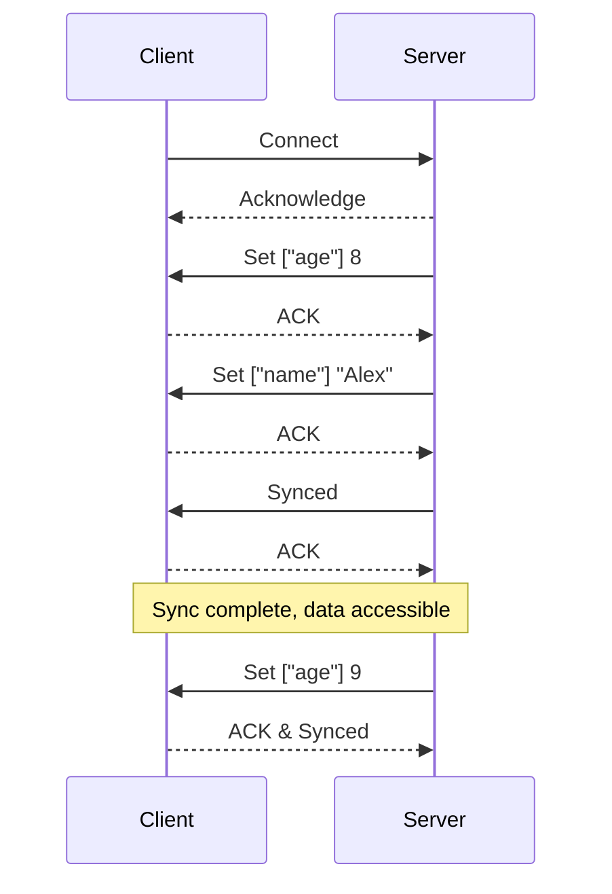

# JSRF 協定

## 簡介

JSRF 協定（JSON 同步與遠端函式協定）旨在實現伺服器與客戶端之間的 JSON 物件同步與遠端函式調用。
此協定特別適用於需要持續追蹤物件狀態、頻繁調用遠端函式以及雙向函式調用或物件編輯的場景。
對於網頁應用，建議使用 WebSocket 實現此協定，若雙方支援 TCP，也可以使用 TCP 實現。

## 實現指南

致 AI 或人類工程師：

1. 使用 `ws` 進行 WebSocket 實現，客戶端使用瀏覽器原生 WebSocket，伺服器使用 `ws` 模組，並搭配 `cbor` 進行負載編碼。
2. 使用 TypeScript 與 ES 模組（ESM）編寫程式碼。
3. 程式碼註釋使用英文撰寫。
4. 測試中避免使用自製的 mock 物件接口，應直接使用現成模組模擬真實情況以提高可靠性。
5. 請注意，本模組提供的伺服器是一個設計用於處理 WebSocket 物件的處理函數。WebSocket 伺服器的初始化與設置不由本模組處理，必須由使用者根據其具體需求自行規劃和實現。

## 概述

JSRF 協定支援 JSON 物件的雙向同步與遠端函式調用，實現客戶端與伺服器之間的動態互動。
實現時必須具備適應性；例如，物件可能來自資料庫，因此 CRUD 操作需與資料庫操作綁定。
所有遠端函式必須是異步函式，以有效處理此類依賴。

## 封包結構

封包由標頭（7-11 字節）和負載（變長）組成。

- 一個連線最多可訂閱 65536 個頻道，每個頻道對應一個服務，伺服器端有一個 Map 記錄服務 ID 與頻道 ID 的對應。
- 首次使用某服務時會查詢頻道 ID，並快取結果以供後續互動使用。
- 序列號（seq）隨每個發送的封包遞增，且不得溢出。
- 收到訊息時以 ACK 回應，若發出訊息後 10 秒內未收到確認，應立即斷開連線。
- 負載可使用 JSON、`cbor`、`@msgpack/msgpack` 或 `@cch137/shuttle` 以陣列格式編碼，推薦使用 `cbor`，因其在大小、速度與擴展性之間取得平衡。

### 標頭結構

| 名稱       | 長度（字節） | 描述                                    |
| ---------- | ------------ | --------------------------------------- |
| 是否有 ack | 1/8          | 枚舉：0 = 否，1 = 是                    |
| 操作碼     | 7/8          | 範圍：[0, 127]                          |
| 頻道       | 2            | 範圍：[0, 65535]                        |
| 序列號     | 4            | 範圍：[0, 2^24-1]                       |
| 確認號     | 4（可選）    | 若 has-ack 為 true 則存在；否則不存在。 |

### 優化說明

為減少開銷，在高頻通訊中可考慮壓縮重複的標頭欄位，或在延遲關鍵時使用更緊湊的二進制格式作為標頭。

## 服務類型

| 類型 | 名稱       | 描述                                 |
| ---- | ---------- | ------------------------------------ |
| 0    | JSON 同步  | 雙向 JSON 物件同步，需遵守嚴格規則。 |
| 1    | 伺服器調用 | 伺服器發起，客戶端回應。             |
| 2    | 客戶端調用 | 客戶端發起，伺服器回應。             |
| 3    | 雙向調用   | 伺服器與客戶端均可發起調用。         |

## 控制訊息

操作碼範圍：[0, 31]
| 操作碼 | 名稱 | 負載 | 描述 | 方向 |
| --------------- | ------------------------ | -------------------------------------------- | -------------------------------------------------------------------- | --------------------------------- |
| 0 | 空 | - | 僅用於 ACK 回應。 | ⇌ |
| 10 | 查詢頻道 | 服務 ID, 服務類型 | 查詢頻道 ID。 | 客戶端 → 伺服器 |
| 11 | 開啟頻道 | 服務 ID, 頻道 ID | 回應頻道 ID。 | 伺服器 → 客戶端 |
| 12 | 關閉頻道 | 頻道 ID | 擦除頻道記錄，用於動態使用。 | 伺服器 → 客戶端 |
| 13 | 頻道錯誤 | 服務 ID | 若找不到頻道 ID 則回應。 | 伺服器 → 客戶端 |
| 20 | 日誌 | 訊息 | 傳輸日誌訊息。 | ⇌ |

## 遠端函式調用

操作碼範圍：[32, 63]

- 調用 ID 是一個 4 字節計數器，每次調用遞增且不溢出。
- 若頻道的處理函式不存在，則回傳錯誤。
- 對於伺服器調用服務，客戶端必須在連線後主動獲取頻道 ID 並註冊處理函式。
  | 操作碼 | 名稱 | 負載 | 描述 |
  | --------------- | ------------- | ---------------------------------- | --------------------------------- |
  | 40 | 調用 | 調用 ID, 參數 | 調用函式。 |
  | 41 | 回傳 | 調用 ID, 值 | 回應結果。 |
  | 42 | 錯誤 | 調用 ID, 訊息 | 回應錯誤。 |

### 示例

假設客戶端調用伺服器函式更新用戶資料：

- 客戶端發送：操作碼 40，調用 ID 1，參數 ["user123", {name: "Alex"}]
- 伺服器回應：操作碼 41，調用 ID 1，值 {status: "success"}

## JSON 同步

操作碼範圍：[64, 127]

- 路徑是有序陣列，用於定位或篩選目標，支援字串、數字或過濾物件。
- 同步必須低延遲，理想情況下在 5 秒內完成。
- 類型不匹配或無效操作會觸發錯誤，未定義的容器會自動初始化。

### 客戶端狀態

| 名稱   | 描述                               | 可讀取物件？ |
| ------ | ---------------------------------- | ------------ |
| 同步中 | 初始或首次同步進行中。             | 否           |
| 錯誤   | 同步錯誤發生，不包括連線問題。     | 是           |
| 已同步 | 同步已開始並完成首次同步。         | 是           |
| 已快取 | 同步暫停，物件已接收但可能已過時。 | 是           |

### 指令

| 操作碼 | 名稱     | 負載           | 容器類型  | 目標類型 | 描述                     |
| ------ | -------- | -------------- | --------- | -------- | ------------------------ |
| 64     | 開始     | -              | -         | -        | 開始同步。               |
| 65     | 停止     | -              | -         | -        | 暫停同步。               |
| 66     | 已同步   | -              | -         | -        | 通知首次同步完成。       |
| 81     | 獲取     | 路徑           | 任意      | 任意     | 請求同步指定鍵。         |
| 82     | 設定     | 路徑, 值       | 物件/陣列 | 任意     | 設定鍵值對。             |
| 83     | 刪除     | 路徑           | 物件/陣列 | 任意     | 刪除指定鍵。             |
| 84     | 推送     | 路徑, 值       | 陣列      | 任意     | 將值添加到陣列尾部。     |
| 85     | 前置推送 | 路徑, 值       | 陣列      | 任意     | 將值添加到陣列頭部。     |
| 86     | 排除     | 路徑, 過濾物件 | 陣列      | 任意     | 移除符合過濾條件的項目。 |
| 87     | 字串連接 | 路徑, 值       | 物件/陣列 | 字串     | 將值附加到當前字串後面。 |
| 99     | 錯誤     | 訊息           | -         | -        | 回報錯誤。               |

### 示例互動

```
連線成功。
伺服器(s0) -> 設定 ["age"] 8
客戶端(c0) -> 確認(s0)
伺服器(s1) -> 設定 ["name"] "Alex"
客戶端(c1) -> 確認(s1)
伺服器(s2) -> 確認(c1) 並已同步
客戶端(c2) -> 確認(s2)
幾分鐘後...
伺服器(s3) -> 設定 ["age"] 9
客戶端(c3) -> 確認(s3) 並已同步
```

## 視覺表示

以下是使用 Mermaid 展示的 JSON 同步互動簡化流程：


